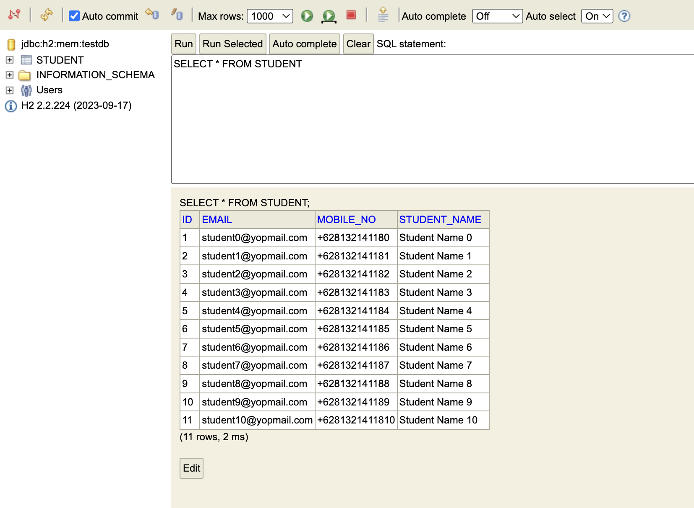
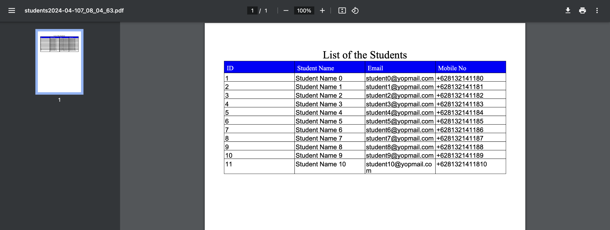

# spring-boot-export-pdf

### Things todo list

1. Clone this repository: `git clone https://github.com/hendisantika/spring-boot-export-pdf.git`
2. Navigate to the folder: `cd spring-boot-export-pdf`
3. Run the application: `mvn clean spring-boot:run`
4. Open your favorite browser: http://localhost:8080/demo/export-to-pdf

### Image Screenshot

H2 Console

Generate PDF File

